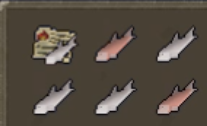
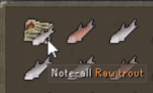

# Banker's Note Overlay Plugin
A plugin that overlays an image of the currently stored item on top of the
Banker's Note in your inventory.

Only tradeable items that can be noted are supported, since the
item's image is looked up by its name using RuneLite's item
price lookup utility. This also means any item naming
discrepancies between Jagex's servers and RuneLite's utility
will cause the plugin to not work.

